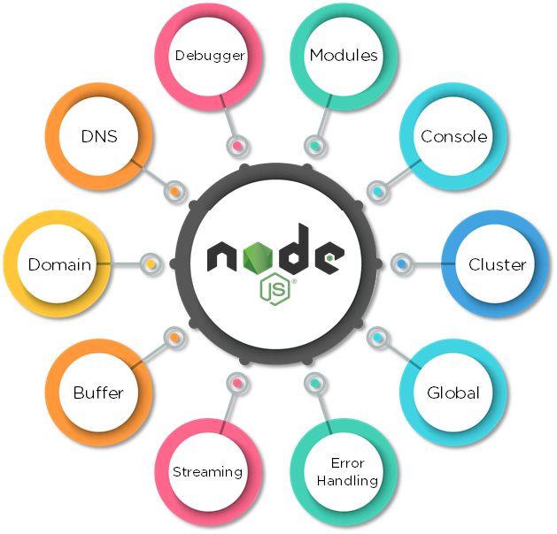
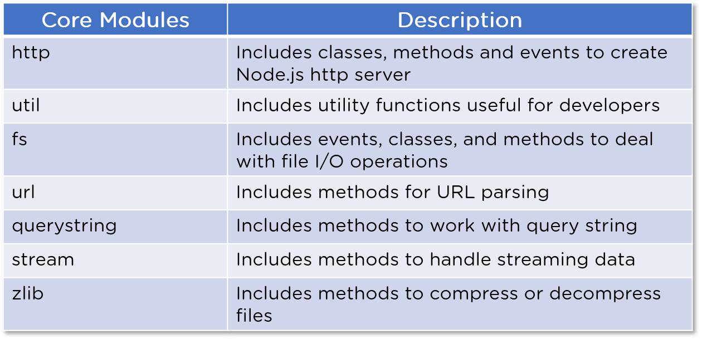
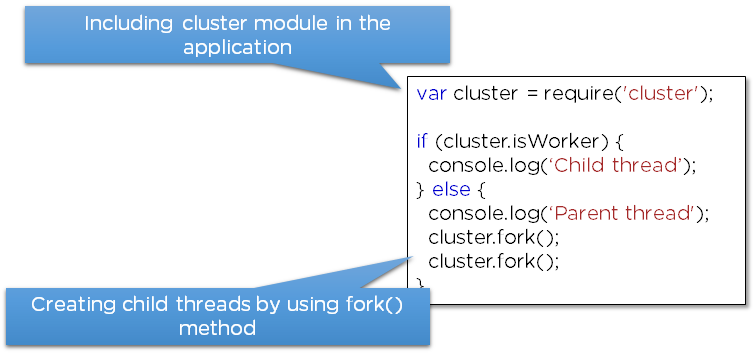
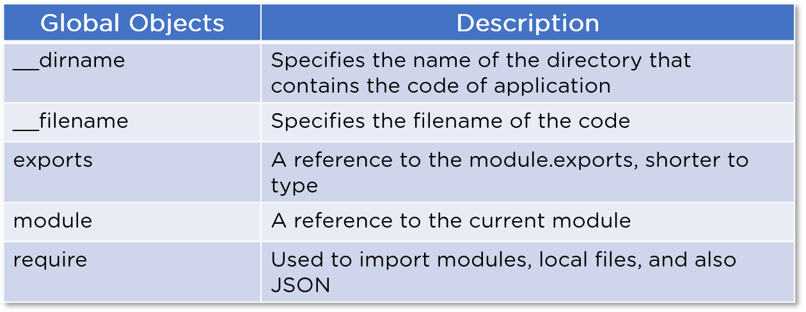
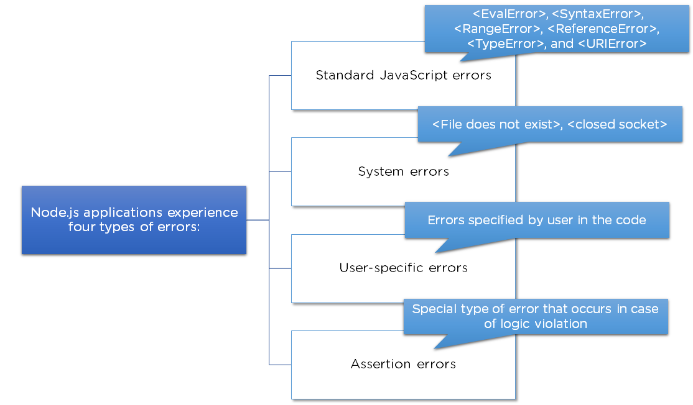

# Table of Contents

-   [What is Node.js?](#org910838e)
-   [Why Node.js?](#org8f626f9)
-   [Parts of Node.js](#orgc8a6fd4)
-   [Modules](#org80f3437)
-   [Console](#orgfca69dd)
-   [Cluster](#org2e5c68b)
-   [Global](#orge429066)
-   [Error Handling](#org15e6f51)
-   [Streaming](#orgd7f79db)
-   [Buffer](#orge2963f7)
-   [Domain](#org510aa28)
-   [DNS](#org65e9c17)
-   [Debugger](#orga55b269)
-   [Node.js Express Framework](#org089c4ef)
-   [Project Modules & Services](#org433e146)
    -   [Modules used:](#orgb0ed87c)
    -   [Services used:](#org8bf29a8)
-   [Course Project](#orge7b8c08)
-   [Useful Resources & Links](#orgad88ffd)

---

Node.js is an extremely powerful JavaScript-based platform used to develop online chat applications, video streaming sites, single-page applications, and many other I/O-intensive web applications and web apps. Built on the JavaScript V8 Engine of Google Chrome, It is used by large, established companies and newly-minted startups alike (Netflix, Paypal, NASA, and Walmart, to name a few).

Node.js is open-source and completely free, used by thousands of developers around the world. It brings plenty of advantages to the table, making it a better choice than other server-side platforms like Java or PHP.

# What is Node.js?

Node.js is an open-source, cross-platform JavaScript runtime environment and library for running web applications outside the client&rsquo;s browser.

# Why Node.js?

Node.js has become the de facto tool for developing server-side and network applications. Here is why:

1.  **Node.js is really fast**: Having been built on Google Chrome&rsquo;s V8 JavaScript engine, its library is extremely fast for code execution.
2.  **Node Package Manager (NPM)**: Node Package Manager has more than 50,000 bundles, so whatever functionality is required for an application can be easily imported from NPM.
3.  **Node.js uses asynchronous programming**: All APIs of Node.js library are asynchronous (i.e., non-blocking), so a Node.js-based server does not wait for the API to return data. The server calls the API, and in the event that no data is returned, the server moves to the next API the Events module of Node.js helps the server get a response from the previous API call. This also helps with the speed of Node.js.
4.  **No buffering**: Node.js dramatically reduces the processing time while uploading audio and video files. Node.js applications never buffer data and simply output the data in chunks.
5.  **Single-threaded**: Node.js makes use of a single-threaded model with event looping. As a result, it can provide service to a much larger number of requests than traditional servers like Apache HTTP Server.
6.  **Highly scalable**: Node.js server responds in a non-blocking way, making it highly scalable in contrast with traditional servers, which create limited threads to handle requests.

# Parts of Node.js

# Modules

Modules are like JavaScript libraries that can be used in a Node.js application to include a set of functions. In order to include a module in a Node.js application, use the require() function with the parenthesis containing the name of the module.

Node.js has many modules that provide the basic functionality needed for a web application. Some of them are mentioned in this table:

# Console

The console is a module that provides a method for debugging that is similar to the basic JavaScript console provided by internet browsers. It prints messages to stdout and stderr.

# Cluster

Node.js is built-on on the concept of single-threaded programming. Cluster is a module that allows multi-threading by creating child processes that share the same server port and run simultaneously.

A cluster can be added to an application in the following way:

# Global

Global objects in Node.js are available in all modules. These objects are functions, modules, strings, etc. Some Node.js global objects are mentioned in the table below:

# Error Handling

Node.js applications experience four types of errors.

Errors in Node.js are handled through exceptions. For example, let&rsquo;s handle the error that would occur when we divide a number by zero. This error would crash the Node.js application, so we should handle this error to continue with the normal execution of the application.

# Streaming

Streams are the objects that let you read data or write data continuously. There are four types of streams:

1.  **Readable**: These are the types of streams from which data can be read
2.  **Writable**: These are the types of streams to which data can be written
3.  **Duplex**: These are both readable and writable streams
4.  **Transform**: Streams that can manipulate the data while it is being read or written

# Buffer

Buffer is a module that allows the handling of streams that contain only binary data.

# Domain

The domain module intercepts errors that remain unhandled. Two methods are used for intercepting these errors:

1.  **Internal Binding**: Error emitter executes its code inside the run method
2.  **External Binding**: Error emitter is explicitly added to a domain via its add method

# DNS

DNS module is used to connect to a DNS server and perform name resolution by using the resolve() method.

DNS module is also used for performing name resolution without a network communication by using the lookup() method:

# Debugger

Node.js includes a debugging utility that can be accessed by a built-in debugging client. Node.js debugger is not feature-packed but supports the simple inspection of code. The debugger can be used in the terminal by using the &rsquo;inspect&rsquo; keyword before the name of the JavaScript file.

# Node.js Express Framework

Express is a flexible Node.js web application framework that provides a wide set of features to develop both web and mobile applications. It&rsquo;s a layer built on the top of the Node.js that helps manage a server and routes.

Now look at some of the core features of the Express framework:

-   Used for designing single-page, multi-page, and hybrid web applications
-   Allows developers to set up middlewares for responding to HTTP Requests
-   Defines a routing table that is used to perform different actions based on the HTTP method and URL
-   Allows dynamic rendering of HTML Pages based on passing arguments to templates

# Project Modules & Services

## Modules used:

-   Node.js,
-   Javascript,
-   Typescript,
-   HTML,
-   CSS,
-   Express.js,
-   Nodemon,
-   SQL,
-   MariaDB,
-   MariaDb/Node.Js Connector,
-   Pug,
-   Express-Handlebars,
-   Ejs,
-   Sequelize,
-   NoSQL,
-   MongoDB,
-   Mongoose,
-   express-session,
-   connect-mongodb-session,
-   bcryptjs,
-   csurf,
-   connect-flash,
-   nodemailer,
-   express-validator,
-   multer,
-   pdfkit,
-   stripe,
-   jsonwebtoken,
-   socket.io,
-   socket.io-client,
-   graphql,
-   express-graphql,
-   helmet,
-   compression,
-   morgan,
-   mocha,
-   chai,
-   sinon,
-   deno

## Services used:

# Course Project

[Products Shop](https://node-complete-guide-2020.herokuapp.com/)

# Useful Resources & Links

-   [MDN JavaScript Tutorial](https://developer.mozilla.org/en-US/docs/Learn/JavaScript)

-   [Academind JS Resources](https://academind.com/learn/javascript)

-   [Official Node.js Docs](https://nodejs.org/en/docs/guides/)

-   [Full Node.js Reference (for all core modules)](https://nodejs.org/dist/latest/docs/api/)

-   [More about the Node.js Event Loop](https://nodejs.org/en/docs/guides/event-loop-timers-and-nexttick/)

-   [Blocking and Non-Blocking Code](https://nodejs.org/en/docs/guides/dont-block-the-event-loop/)

-   [More on debugging Node.js](https://nodejs.org/en/docs/guides/debugging-getting-started/)

-   [Debugging Node in Visual Studio Code](https://code.visualstudio.com/docs/nodejs/nodejs-debugging)

-   [https://www.npmjs.com/package/express-ws](https://expressjs.com/en/starter/installing.html)

-   [Pug Docs](https://pugjs.org/api/getting-started.html)

-   [Handlebars Docs](https://handlebarsjs.com/)

-   [EJS Docs](http://ejs.co/#docs)

-   [More on MVC](https://developer.mozilla.org/en-US/docs/Glossary/MVC)

-   [Official Routing Docs](https://expressjs.com/en/guide/routing.html)

-   [Learn more about MySQL/ SQL in General](https://www.w3schools.com/sql/)

-   [Learn more about the Node MySQL Package](https://github.com/sidorares/node-mysql2)

-   [Sequelize Official Docs](http://docs.sequelizejs.com/)

-   [Mongoose Official Docs](https://mongoosejs.com/docs/)

-   [More on Sessions](https://www.quora.com/What-is-a-session-in-a-Web-Application)

-   [More on Cookies](https://developer.mozilla.org/en-US/docs/Web/HTTP/Cookies)

-   [Express-session Official Docs](https://github.com/expressjs/session)

-   [Bcrypt Official Docs](https://github.com/dcodeIO/bcrypt.js)

-   [More on CSRF Attacks](https://www.acunetix.com/websitesecurity/csrf-attacks/)

-   [Nodemailer Official Docs](https://nodemailer.com/about/)

-   [SendGrid Official Docs](https://sendgrid.com/docs/)

-   [Express-Validator Docs](https://express-validator.github.io/docs/)

-   [Validator.js (which is used behind the scenes) Docs](https://github.com/chriso/validator.js)

-   [Error Handling in Express.js - Official Docs](https://expressjs.com/en/guide/error-handling.html)

-   [Multer Official Docs](https://github.com/expressjs/multer)

-   [Streaming Files](https://medium.freecodecamp.org/node-js-streams-everything-you-need-to-know-c9141306be93)

-   [Generating PDFs with PDFKit](http://pdfkit.org/docs/getting_started.html)

-   [More on the fetch API](https://developers.google.com/web/updates/2015/03/introduction-to-fetch)

-   [More on AJAX Requests](https://developer.mozilla.org/en-US/docs/Web/Guide/AJAX/Getting_Started)

-   [Official Stripe.js Docs](https://stripe.com/docs)

-   [Example: Build a Complete RESTful API from Scratch](https://academind.com/learn/node-js/building-a-restful-api-with/)

-   [Async-await - More Details](https://developer.mozilla.org/en-US/docs/Web/JavaScript/Reference/Statements/async_function)

-   [Socket.io Official Docs](https://socket.io/get-started/chat/)

-   [Alternative Websocket Library](https://www.npmjs.com/package/express-ws)

-   [Detailed Guide on GraphQ](https://graphql.org)

-   [Herokus Docs](https://devcenter.heroku.com/categories/reference)

-   [Deploying SPAs (like our React App)](https://medium.com/@baphemot/understanding-react-deployment-5a717d4378fd)

-   [Mocha](https://mochajs.org/)

-   [Chai](https://www.chaijs.com/)

-   [Sinon](https://sinonjs.org/)

-   [Official npm Docs](https://docs.npmjs.com/)

-   [Learn more about Webpack (a build tool using Node.js)](https://academind.com/learn/webpack)

-   [More on Node & ES Modules](https://nodejs.org/dist/latest-v14.x/docs/api/esm.html)

